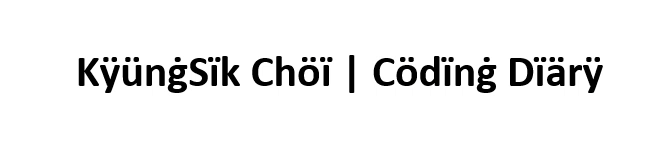

<!--
**chlrudtlr/chlrudtlr** is a ✨ _special_ ✨ repository because its `README.md` (this file) appears on your GitHub profile.

Here are some ideas to get you started:

- 🔭 I’m currently working on ...
- 🌱 I’m currently learning ...
- 👯 I’m looking to collaborate on ...
- 🤔 I’m looking for help with ...
- 💬 Ask me about ...
- 📫 How to reach me: ...
- 😄 Pronouns: ...
- ⚡ Fun fact: ...
-->

  

<h3>📊 GitHub Stats</h3>

  
  &nbsp;
  
  &nbsp;
  
  &nbsp;
  

 

  
  &nbsp;
  

 
<h3>🌿 My Tech Stack</h3>

  
  &nbsp;
  
  &nbsp;
  
  &nbsp;
  
  &nbsp;
  
  &nbsp;
  
  &nbsp;
  

 

<h3>🛠 My Development Tools</h3>

  
  &nbsp;
  
  &nbsp;
  
  &nbsp;
  
  &nbsp;
  
  &nbsp;
  
  &nbsp;
  

 

<h3>📬 About Me</h3>

  <a href="misosunboy2@naver.com">
    

    <a href="https://velog.io/@misosunboy2/posts">
  

